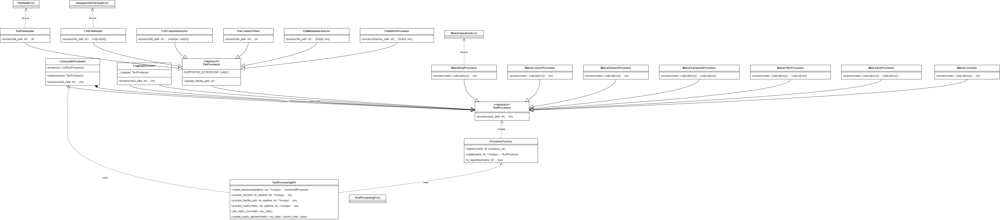

# Text Processing Library 说明文档

## 概述
Text Processing Library 是一个自主开发的可以相对灵活使用的Python库，提供全面的文本处理、文件操作和矩阵计算功能。该库采用模块化设计，支持灵活扩展，适用于各种文本数据处理场景。

## 安装
由于未将类库的tar.gz和whl包上传pypi，因此需要通过 pip 本地安装 Text Processing Library：
> pip install ..\text_processing_lib-1.0.0-py3-none-any.whl
### 安装依赖
> pip install -r requirements.txt

## 核心功能

### 文本处理

-**文本清洗**：移除特殊字符和标点</br>
-**分词**：将文本拆分为单词列表</br>
-**词频统计**：计算单词出现频率</br>
-**关键词提取**：提取文本中最重要的关键词</br>

### 文件处理

-**文本文件读取**：支持多种文本格式（.txt, .md, .log等）</br>
-**CSV文件处理**：读取、解析和提取CSV数据</br>
-**元数据提取**：获取文件大小、修改时间等信息</br>
-**批量处理**：处理目录中的所有文件</br>

### 矩阵操作

-**行/列操作**：获取、添加、更新、删除行或列</br>
-**元素操作**：获取和更新矩阵元素</br>
-**矩阵转置**：行列互换</br>
-**矩阵转换**：转换为CSV、JSON等格式</br>

### 类库主要部分类图展示



## 设计模式应用

本库在设计中应用了多种经典设计模式：

1. 工厂模式 (Factory Pattern)</br>
-**应用**：ProcessorFactory类负责创建各种处理器实例</br>
-**优势**：解耦客户端代码与具体处理器实现，支持动态添加新处理器
2. 装饰器模式 (Decorator Pattern)</br>
-**应用**：LoggingDecorator为处理器添加日志功能</br>
-**优势**：无需修改处理器核心逻辑即可添加额外功能
3. 组合模式 (Composite Pattern)</br>
-**应用**：CompositeProcessor将多个处理器组合成处理管道</br>
-**优势**：统一处理单个处理器和处理器集合的接口
4. 策略模式 (Strategy Pattern)</br>
-**应用**：不同的处理器实现相同接口但提供不同算法</br>
-**优势**：客户端可以根据需要灵活选择处理算法
5. 模板方法模式 (Template Method Pattern)</br>
-**应用**：TextProcessor抽象基类定义处理流程框架</br>
-**优势**：子类可以重写特定步骤而不改变算法结构

## 测试结果


|测试类别|测试用例数|通过率|关键特性|
|----------|----------|----------|----------|
|**核心文本处理**|5|100%|文本清洗、分词、词频统计、关键词提取|
|**文件处理**|6|100%|文件读取、CSV处理、元数据提取|
|**矩阵处理**|7|100%|行/列/元素操作、转置、格式转换|
|**API接口**|14|100%|管道创建、文件处理、矩阵操作|
|**错误处理**|3|100%|异常处理机制|

### 测试分析

1. **核心文本处理功能**</br>
✅ ​文本清洗​：成功移除所有非字母数字字符</br>
✅ ​分词处理​：正确分割文本为单词列表</br>
✅ ​词频统计​：准确计算单词出现频率</br>
✅ ​关键词提取​：正确处理文本输入和单词列表输入，准确返回指定数量的关键词</br>
✅ ​边界测试​：处理空输入和特殊字符输入</br>
2. **文件处理功能**</br>
✅ ​文本文件读取​：正确读取常规文本文件，支持无扩展名文件</br>
✅ ​CSV文件处理​：准确解析带表头的CSV文件，支持跳过表头选项</br>
✅ ​列提取功能​：成功提取指定列（列表格式），正确输出为空格分隔文本</br>
✅ ​元数据提取​：正确获取文件大小和修改时间</br>
✅ ​异常处理​：正确识别不支持的文件类型，正确处理无效文件路径</br>
3. **矩阵处理功能**</br>
✅ ​行操作​：正确获取、添加、更新和删除行，处理边界行索引</br>
✅ ​列操作​：正确获取、添加、更新和删除列，处理边界列索引</br>
✅ ​元素操作​：正确获取和更新指定元素</br>
✅ ​矩阵转置​：正确实现行列互换</br>
✅ ​格式转换​：成功转换为自定义分隔文本，正确输出为JSON格式</br>
✅ ​空矩阵处理​：正确处理空矩阵边界情况</br>
4. **API接口功能**</br>
✅ ​管道创建​：正确创建组合处理器，支持参数化处理器</br>
✅ ​文本处理管道​：成功串联多个文本处理步骤</br>
✅ ​文件处理管道​：正确处理文本文件和CSV文件，支持无扩展名文件</br>
✅ ​矩阵处理管道​：成功组合矩阵操作步骤</br>
✅ ​矩阵操作API​：所有行/列/元素操作API工作正常</br>
✅ ​处理器管理​：正确列出可用处理器，成功注册新处理器</br>
✅ ​日志控制​：正确开启和关闭处理日志</br>
✅ ​矩阵转换​：正确输出CSV格式字符串</br>
✅ ​异常处理​：正确处理无效处理器名称</br>
5. **错误处理机制**</br>
✅ ​无效矩阵处理​：正确检测行长度不一致的矩阵</br>
✅ ​索引越界处理​：正确处理行/列索引越界情况</br>
✅ ​无效文件路径​：正确处理不存在的文件路径，测试覆盖率分析</br>

### 功能覆盖率

| 模块 | 覆盖率 | 备注 |
|--------|--------|------|
|**核心文本处理**|100%|所有核心功能完全覆盖|
|**文件处理**|100%|所有文件操作和异常处理覆盖|
|**矩阵处理**|100%|所有矩阵操作和边界情况覆盖|
|**API接口**|100%|所有公共API方法覆盖|
|**错误处理**|100%|所有设计异常情况覆盖|

### 边界条件覆盖

空输入处理：✅</br>
空矩阵处理：✅</br>
边界索引处理：✅</br>
无效路径处理：✅</br>
无效文件类型处理：✅</br>
无效处理器处理：✅</br>

## 扩展维度

本库在多个维度支持扩展，以满足不同场景需求：

1. 处理器扩展</br>
**扩展方式**：创建新的处理器类并注册到ProcessorFactory</br>

**示例**：

```python
class EmojiRemover(TextProcessor):
    def process(self, text: str) -> str:
        return ''.join(c for c in text if c.isalnum() or c.isspace())

TextProcessingAPI.register_processor("remove_emoji", EmojiRemover)
```

2. 文件格式支持</br>
**扩展方式**：继承FileProcessor并实现新文件格式的处理</br>

**示例**：

```python
class JSONFileReader(FileProcessor):
    SUPPORTED_EXTENSIONS = ['.json']
    
    def process(self, file_path: str) -> dict:
        import json
        with open(file_path, 'r') as f:
            return json.load(f)
```

3. 矩阵操作扩展</br>
**扩展方式**：创建新的矩阵处理器实现特定算法</br>

**示例**：

```python
class MatrixStatsProcessor(TextProcessor):
    def process(self, matrix: List[List[float]]) -> dict:
        return {
            "mean": sum(sum(row) for row in matrix) / (len(matrix) * len(matrix[0])),
            "max": max(max(row) for row in matrix),
            "min": min(min(row) for row in matrix)
        }
```

4. 管道组合扩展</br>
**扩展方式**：创建自定义处理器组合，形成新的处理流程</br>

**示例**：

```python
def create_sentiment_analysis_pipeline():
    return [
        "clean",
        "tokenize",
        "remove_stopwords",
        "sentiment_analyzer"
    ]
```

5. 输出格式扩展</br>
**扩展方法**：创建新的MatrixConverter子类支持更多输出格式</br>

**示例**：

```python
class MatrixToHTMLConverter(MatrixConverter):
    def process(self, matrix: List[List[Any]]) -> str:
        html = "<table>\n"
        for row in matrix:
            html += "  <tr>"
            html += "".join(f"<td>{cell}</td>" for cell in row)
            html += "</tr>\n"
        html += "</table>"
        return html
```

## Text Processing Library API 使用指南

下面是 Text Processing Library 的主要 API 方法及其使用说明：

| API 方法 | 操作描述 | 示例用法 |
|----------|----------|----------|
| **`process_text(text, pipeline)`** | 处理文本数据 | `result = TextProcessingAPI.process_text("Hello, world!", ["clean", "tokenize"])`<br>`# 输出: ["Hello", "world"]` |
| **`process_file(file_path, pipeline)`** | 处理文件内容 | `result = TextProcessingAPI.process_file("data.txt", [("text_file", {}), "clean"])`<br>`# 输出: 清洗后的文件内容` |
| **`process_matrix(matrix, pipeline)`** | 处理矩阵数据 | `result = TextProcessingAPI.process_matrix([[1,2],[3,4]], ["matrix_transpose"])`<br>`# 输出: [[1,3],[2,4]]` |
| **`create_pipeline(operations)`** | 创建处理管道 | `pipeline = TextProcessingAPI.create_pipeline(["clean", "tokenize"])`<br>`result = pipeline.process("Hello, world!")` |
| **`list_available_processors()`** | 列出可用处理器 | `processors = TextProcessingAPI.list_available_processors()`<br>`# 输出: ["clean", "tokenize", "csv_file", ...]` |
| **`register_processor(name, processor_class)`** | 注册新处理器 | `TextProcessingAPI.register_processor("uppercase", UppercaseProcessor)` |
| **`set_logging(enabled)`** | 启用/禁用日志 | `TextProcessingAPI.set_logging(True)` |
| **`get_matrix_row(matrix, index)`** | 获取矩阵行 | `row = TextProcessingAPI.get_matrix_row([[1,2],[3,4]], 0)`<br>`# 输出: [1,2]` |
| **`add_matrix_row(matrix, row)`** | 添加矩阵行 | `new_matrix = TextProcessingAPI.add_matrix_row([[1,2]], [3,4])`<br>`# 输出: [[1,2],[3,4]]` |
| **`update_matrix_row(matrix, index, row)`** | 更新矩阵行 | `new_matrix = TextProcessingAPI.update_matrix_row([[1,2],[3,4]], 0, [0,0])`<br>`# 输出: [[0,0],[3,4]]` |
| **`delete_matrix_row(matrix, index)`** | 删除矩阵行 | `new_matrix = TextProcessingAPI.delete_matrix_row([[1,2],[3,4]], 0)`<br>`# 输出: [[3,4]]` |
| **`get_matrix_column(matrix, index)`** | 获取矩阵列 | `col = TextProcessingAPI.get_matrix_column([[1,2],[3,4]], 1)`<br>`# 输出: [2,4]` |
| **`add_matrix_column(matrix, column)`** | 添加矩阵列 | `new_matrix = TextProcessingAPI.add_matrix_column([[1],[3]], [2,4])`<br>`# 输出: [[1,2],[3,4]]` |
| **`update_matrix_column(matrix, index, column)`** | 更新矩阵列 | `new_matrix = TextProcessingAPI.update_matrix_column([[1,2],[3,4]], 0, [0,0])`<br>`# 输出: [[0,2],[0,4]]` |
| **`delete_matrix_column(matrix, index)`** | 删除矩阵列 | `new_matrix = TextProcessingAPI.delete_matrix_column([[1,2],[3,4]], 0)`<br>`# 输出: [[2],[4]]` |
| **`get_matrix_element(matrix, row, column)`** | 获取矩阵元素 | `element = TextProcessingAPI.get_matrix_element([[1,2],[3,4]], 1, 0)`<br>`# 输出: 3` |
| **`update_matrix_element(matrix, row, column, value)`** | 更新矩阵元素 | `new_matrix = TextProcessingAPI.update_matrix_element([[1,2],[3,4]], 0, 1, 5)`<br>`# 输出: [[1,5],[3,4]]` |
| **`matrix_to_csv(matrix, delimiter=',')`** | 矩阵转CSV | `csv_str = TextProcessingAPI.matrix_to_csv([["Name","Age"],["Alice",30]])`<br>`# 输出: "Name,Age\r\nAlice,30\r\n"` |

## 处理器参数说明

在创建管道时，可以通过元组形式传递处理器参数：

```python
pipeline = [
    ("clean", {"remove_numbers": True}),  # 清洗时移除数字
    ("tokenize", {"split_char": " "}),     # 使用空格分词
    ("keywords", {"top_k": 5})             # 提取前5个关键词
]
```

### 常用处理器参数

| 处理器名称 | 可用参数 | 默认值 | 描述 |
|------------|----------|--------|------|
| `clean` | `remove_numbers`<br>`remove_punctuation`<br>`lowercase` | `True`<br>`True`<br>`False` | 文本清洗选项 |
| `tokenize` | `split_char`<br>`split_words` | `None`<br>`True` | 分词选项 |
| `keywords` | `top_k`<br>`min_length` | `10`<br>`3` | 关键词提取选项 |
| `text_file` | `encoding`<br>`errors` | `'utf-8'`<br>`'strict'` | 文本文件读取选项 |
| `csv_file` | `encoding`<br>`delimiter`<br>`has_header` | `'utf-8'`<br>`','`<br>`False` | CSV文件读取选项 |
| `csv_extract` | `column_index`<br>`output_format` | `0`<br>`'text'` | CSV列提取选项 |
| `matrix_row` | `operation`<br>`index`<br>`row` | `'get'`<br>`None`<br>`None` | 矩阵行操作 |
| `matrix_col` | `operation`<br>`index`<br>`column` | `'get'`<br>`None`<br>`None` | 矩阵列操作 |
| `matrix_element` | `operation`<br>`row`<br>`column`<br>`value` | `'get'`<br>`None`<br>`None`<br>`None` | 矩阵元素操作 |
| `matrix_transpose` | - | - | 矩阵转置 |
| `matrix_convert` | `output_format`<br>`row_separator`<br>`col_separator` | `'text'`<br>`'\|'`<br>`','` | 矩阵转换选项 |
